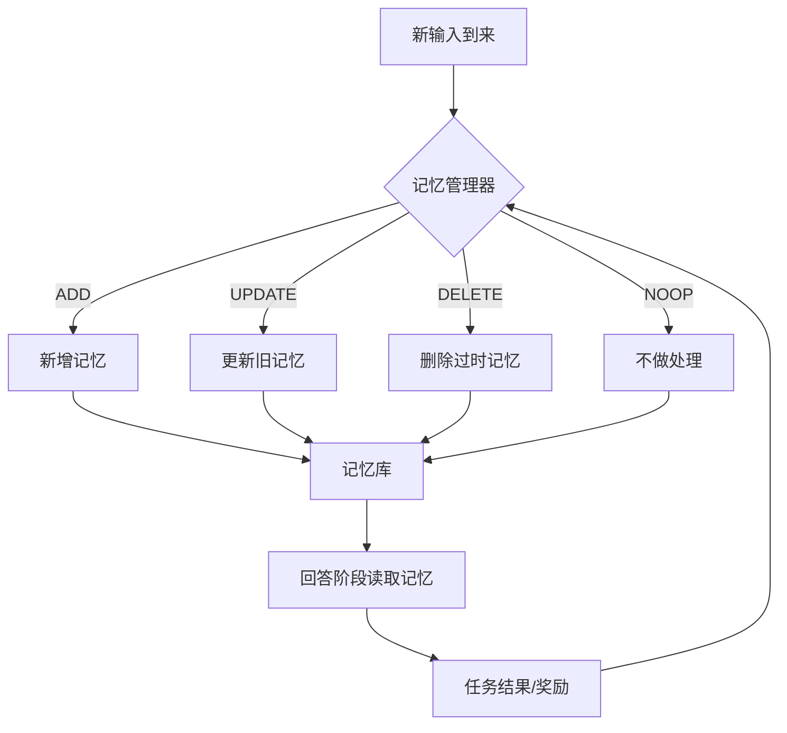

# 方向 A：RL 驱动的记忆策略

## 先用人话讲

这个方向研究的是：

**不要再用人工规则决定"什么该记、什么该删"，而是让模型自己学。**

你可以把它理解成给 agent 配一个"记忆管理员"。
这个管理员每次看到新信息，都要做决定：

- 记下来
- 更新旧记忆
- 删除旧记忆
- 什么都不做
- 有时还要总结压缩

过去很多系统的做法像这样：

```text
如果相似度 > 阈值，就存
如果太旧了，就删
如果命中 top-k，就拿来回答
```

RL 路线的想法是：

```text
别手写规则了，让模型在试错中学会这些决策。
```

---

## 一个生活类比

把 agent 想成一个秘书。

每天你都在跟秘书说很多事：
- "我下周三开会"
- "我喜欢简洁风格"
- "把刚才那个方案废弃"
- "以后代码解释要短一点"

一个差的秘书会：
- 什么都记，最后笔记本爆炸
- 该记的不记
- 旧信息和新信息冲突也不处理

这个方向要做的，就是训练一个更聪明的秘书，
让它通过反馈学会怎样管理笔记。

---

## 这个方向到底在解决什么痛点

很多记忆系统真正难的不是"怎么存"，而是"怎么决策"：

- 什么时候该写入
- 写入一条新记忆，还是更新旧记忆
- 哪些旧记忆已经过时
- 哪些记忆应该保留原文，哪些应该压缩成摘要
- 当前问题来了，应该读哪几条

RL 路线认为这些都是**策略问题**，不是单纯检索问题。

---

## 直观流程图



这张图里最关键的一步是最后那条回路：

**回答得好不好，会反过来训练记忆管理器。**

---

## 现有代表工作在做什么

### 1. AgeMem / Agentic Memory

核心思想：
- 把记忆操作做成 tool
- 让 agent 自己决定什么时候存、删、总结、检索
- 用多阶段训练把长期记忆和短期记忆管理一起学出来

你可以把它看成：

**"agent 自治式记忆管理"**

### 2. Memory-R1

核心思想：
- 单独训练一个 Memory Manager
- 对记忆做结构化操作：`ADD / UPDATE / DELETE / NOOP`
- 再配一个 Answer Agent 用这些记忆回答问题

你可以把它看成：

**"把记忆管理变成可学习的 CRUD 决策"**

### 3. Mem0 这类工业框架

更偏产品和工程：
- 自动提取用户偏好、事实、设定
- 做更新、去重、长期保留
- 目标是可接入生产系统

它们说明这条路线不只是论文想法，已经进入工业层面。

---

## 这个方向为什么热门

因为它碰到了 agent memory 的核心矛盾：

```text
记太多 -> 污染、冗余、成本高
记太少 -> 回忆失败、长期不稳定
```

手工规则很难兼顾各种任务。

RL 的吸引力在于：
- 可以针对特定任务优化
- 可以学复杂策略组合
- 可以随着 reward 变化不断改进

---

## 这个方向和你现有文献怎么接上

它不是凭空冒出来的，而是可以和你已经读过的论文组合：

- 和 `MemGPT` 接上：把"OS 式 memory flow"从规则改成可学习策略
- 和 `FadeMem` 接上：把遗忘强度不再手工设，而是部分交给策略决定
- 和 `EM-LLM` 接上：不是对固定 chunk 做操作，而是对"事件"做操作
- 和 `GSW` 接上：不是只 CRUD 文本块，而是 CRUD 结构化工作空间
- 和 `SYNAPSE` 接上：操作对象可以是图节点和边，不只是文本片段

所以真正有意思的研究不是：

```text
只做一个会 ADD/DELETE 的 manager
```

而是：

```text
让 manager 学会管理更像认知记忆结构的对象
```

---

## 它的核心难点

### 1. Reward 很难设计

你怎么告诉系统：
- 这次存得好
- 这次删得对
- 这次总结没有丢关键事实

很多时候结果是延迟出现的。

例如：
- 现在存了一条记忆
- 三天后回答问题时才体现价值

这就是典型的延迟奖励问题。

### 2. 训练成本高

RL 比普通 SFT 更贵、更慢、更不稳定。

### 3. 容易学到投机策略

例如系统可能学会：
- 什么都不记，避免犯错
- 什么都记，碰运气
- 过度依赖模板化操作

### 4. 可解释性不如规则系统

规则系统虽然笨，但你至少知道它为什么这么做。
RL 学出来的策略，有时很难解释。

---

## 适合做什么样的研究问题

### 适合的问题

- 如何学习写入/删除/更新策略
- 如何联合学习"记忆管理 + 回答"
- 如何把记忆操作从文本级提升到事件级、图级、结构级
- 如何在长对话、多 session agent、中长期任务里稳定训练

### 不太适合拿来做首篇论文的问题

- 只把几个 heuristics 换成 RL
- 只证明 RL 比规则强一点点
- 没有解释策略到底学到了什么

---

## 一个新手可理解的实验设计

### 最小可行版本

1. 输入一段多轮对话
2. 每轮抽取候选记忆
3. 让 manager 选择：
   - `ADD`
   - `UPDATE`
   - `DELETE`
   - `NOOP`
4. 用记忆库回答后续问题
5. 根据答案质量、存储大小、冲突率给 reward

### 可以看的指标

- QA 准确率
- 长期回忆率
- 存储占用
- 冲突记忆比例
- 无效记忆比例
- 每轮操作次数

---

## 这个方向的风险评估

| 维度 | 评价 |
|------|------|
| 创新空间 | 仍有，但已开始拥挤 |
| 工程难度 | 高 |
| 训练成本 | 高 |
| 发论文难度 | 中高 |
| 和现有文献差异化难度 | 高 |

---

## 最后一句话

这个方向的本质不是"让模型更会检索"，而是：

**让模型学会像一个长期工作的记忆管理员那样做决策。**

如果你要做它，最好不要只做 CRUD，而要结合：
- 事件分割
- 结构化记忆
- 冲突消解
- 遗忘机制

这样才更像完整研究，而不是把 RL 硬套上去。

---

## 可继续参考

- AgeMem / Agentic Memory: https://arxiv.org/abs/2601.01885
- Memory-R1: https://arxiv.org/abs/2508.19828
- Letta memory benchmark blog: https://www.letta.com/blog/letta-leaderboard

