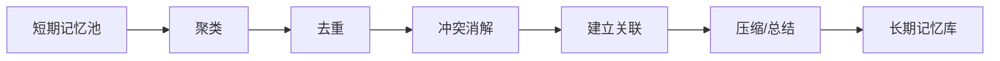
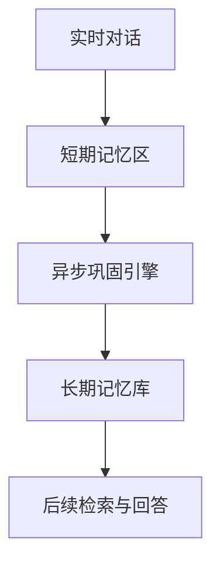

# 方向 B：记忆巩固（Memory Consolidation）

## 先用人话讲

这个方向研究的是：

**记忆不是写进去就结束了，中间还要整理。**

人脑不是把经历原封不动扔进仓库就完事。
它会在之后做很多事情：

- 把碎片经历拼起来
- 把重复信息合并
- 把短期经验变成长期知识
- 建立跨事件关联
- 解决新旧记忆冲突

这个整理过程，就叫**记忆巩固**。

---

## 一个最简单的比喻

白天你上课记了一堆零散笔记：

- 老师提了一个概念
- 做了一个实验
- 举了三个例子
- 你又记了几个自己的疑问

当时这些内容很碎。

晚上你回去整理时，你会做的事是：

- 把同一主题的内容放在一起
- 去掉重复
- 把例子上升成结论
- 把错误理解修正掉
- 和前几天学过的东西连起来

这就是"巩固"。

如果不整理，第二天你只会得到一堆碎片。

---

## 这个方向为什么重要

当前很多 LLM 记忆系统的问题不是不会存，而是：

**存了很多，但存得太碎。**

常见问题：
- 一件事被拆成很多小块，互相孤立
- 同一偏好被记了很多遍
- 老信息和新信息互相打架
- 只会追加，不会重组
- 只能检索到局部片段，拿不到整条事件链

所以，光有"写入"和"检索"还不够。
中间需要一个整理层。

---

## 直观流程图



也可以把它想成：

```text
白天先记 -> 晚上再整理 -> 以后更容易想起来
```

---

## 它和普通"写入记忆"有什么区别

很多系统当前做的是：

```text
新信息来了 -> 直接存库
```

巩固做的是：

```text
新信息先进入短期区
等到合适时机，再统一整理后写入长期区
```

这里的关键区别是：

- 直接写入：快，但粗糙
- 巩固后写入：慢一点，但质量高

---

## 现有工作做到哪了

### 1. M+

做了什么：
- 短期 latent memory 放不下时，溢出到长期 cache

它解决的是：
- 容量问题

它没真正解决的是：
- 这些记忆如何被系统整理、合并、重组

所以 M+ 更像：

**"搬仓库"**

还不是：

**"整理仓库"**

### 2. FadeMem

做了什么：
- 记忆衰减
- 记忆融合
- 冲突处理
- 双层记忆迁移

它已经很接近巩固问题了。

但它主要还是围绕：
- 存储效率
- 遗忘控制
- 规则化融合

还没有把巩固做成一个独立、系统、异步的模块。

### 3. MemGPT / AgeMem 这类系统

会做总结、分页、压缩。

但这些更多是：
- 工程上的上下文管理
- 实用层面的 summary

还不是认知意义上的系统性巩固。

---

## 这个方向真正想回答的问题

### 问题 1

什么信息应该先留在短期区，暂时别急着写成长期记忆？

### 问题 2

什么时候启动巩固？

可能的触发时机：
- 一段对话结束后
- 每 N 轮后
- 系统空闲时
- 遇到重要事件后

### 问题 3

巩固时到底要做哪些操作？

可能包括：
- 聚类
- 去重
- 结构化抽取
- 冲突消解
- 事件链重建
- 语义提升
- 记忆摘要化

### 问题 4

巩固之后，记忆到底变好了没有？

这需要真正的评测。

---

## 为什么说它现在相对更空白

因为多数现有工作都把注意力放在：

- 怎么写
- 怎么检索
- 怎么忘

但比较少有人单独把"整理过程"拿出来建模。

换句话说，很多系统默认：

```text
存储 = 记忆形成
```

而巩固路线认为：

```text
存储只是开始
整理、重组、抽象、关联，才决定长期质量
```

这正是它的研究价值。

---

## 这个方向最像什么系统模块

你可以把它理解成一个**异步后台任务**。

前台：
- 用户正在和 agent 聊天
- 系统只维护短期记忆，保证实时性

后台：
- 系统在空闲时整理最近收集到的短期记忆
- 把整理好的内容写入长期记忆库

结构上像这样：



---

## 可以怎么做一个有意思的方法

一个比较自然的设计是：

### 第一步：把短期记忆按事件聚类

不是按固定 chunk，而是按：
- 时间接近
- 实体重合
- 主题相似
- 因果连续

### 第二步：对每个事件簇做结构化整理

抽出：
- 参与者
- 时间地点
- 关键动作
- 结果
- 用户偏好变化

### 第三步：和旧长期记忆比对

判断：
- 是新增
- 是更新
- 是矛盾
- 是更高层抽象

### 第四步：建立跨事件关联

例如：
- 这次争执和上次争执是同一主题
- 这次偏好改变是上次负面体验导致的

### 第五步：再写入长期库

这样长期库里的内容，就不只是原始片段，而是被整理过的记忆单元。

---

## 这个方向最适合做哪些实验

### 实验 1：保留率 vs 存储量

比较：
- 直接追加存储
- 规则融合
- 异步巩固

看谁在更少存储下保住更多关键记忆。

### 实验 2：长程问答表现

问题类型可以包括：
- 多轮后回忆
- 跨 session 回忆
- 事件链追踪
- 冲突更新

### 实验 3：结构质量评估

看巩固后是否：
- 冗余更少
- 冲突更少
- 事件边界更清晰
- 关系更完整

### 实验 4：在线 vs 离线成本

巩固如果放到后台，能否减少实时推理负担？

---

## 它的关键难点

### 1. 巩固目标不好定义

什么叫整理得好？

是更短？
更准确？
更容易检索？
更接近人类记忆结构？

这些目标可能互相冲突。

### 2. 容易在压缩时丢信息

总结和融合一旦做得不好，就会把关键细节抹掉。

### 3. 评测不成熟

目前大多数 benchmark 主要测 retrieval 和 QA，
专门测 consolidation 的 benchmark 很少。

### 4. 需要和写入、遗忘、检索一起协调

巩固不是孤立模块。
它会影响整个记忆系统。

---

## 风险评估

| 维度 | 评价 |
|------|------|
| 创新空间 | 高 |
| 竞争拥挤度 | 相对低 |
| 工程难度 | 中高 |
| 理论支撑 | 强 |
| 适合做首篇论文吗 | 很适合 |

---

## 最后一句话

这个方向的本质不是"让系统存更多"，而是：

**让系统把记过的东西整理成以后真的好用的长期记忆。**

如果你想找一个既有认知科学味道、又还没被挤爆的方向，
它是目前最值得认真看的。

---

## 可继续参考

- Memory for Autonomous LLM Agents: https://arxiv.org/abs/2603.07670
- M+: https://proceedings.mlr.press/v267/wang25au.html
- FadeMem: https://arxiv.org/abs/2601.18642

