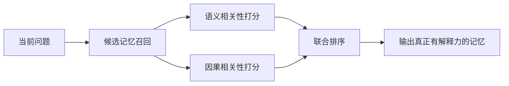
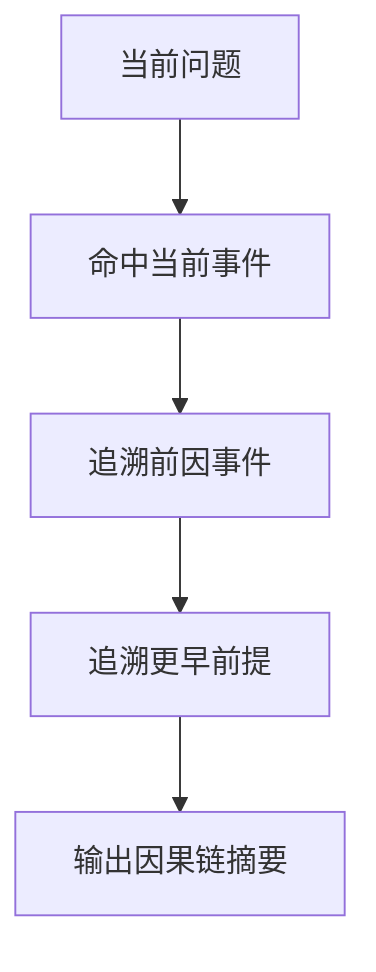

# 方向 C：因果驱动检索（Causally Grounded Retrieval）

## 先用人话讲

这个方向研究的是：

**系统不只要找"像当前问题的记忆"，还要找"真正导致当前问题答案的记忆"。**

这是一个很关键但常被忽略的区别。

---

## 一个最简单的例子

用户问：

```text
为什么我后来不喜欢蓝色界面了？
```

普通语义检索可能找到：
- "用户不喜欢蓝色"
- "用户提到界面"
- "用户讨论过配色"

这些都很像，但未必解释原因。

真正有用的记忆可能是：

```text
上周用户说那个蓝色 dashboard 让他联想到公司旧系统，
而旧系统给过他很多糟糕体验。
```

这条记忆不一定和当前问题在表面字面上最像，
但它在因果上更关键。

---

## 这个方向为什么重要

现在很多检索方法默认：

```text
相似 = 有用
```

但现实里经常不是这样。

例如：
- 最像的问题背景，不一定是决定答案的前提
- 最像的事实，不一定解释行为变化
- 最像的对话片段，不一定是最终决策的原因

所以这个方向要解决的是：

**从"像不像"升级到"有没有因果作用"。**

---

## 直观流程图



重点不是抛弃语义相关性，而是：

**在语义相关性之上，再加一层因果判断。**

---

## 什么叫"因果相关"

可以简单理解成：

这条记忆是不是下面这些东西之一：

- 当前问题的原因
- 当前状态的前提
- 某个偏好变化的触发事件
- 某个决策的依据
- 某个结果的上游条件

它不一定和 query 文本最像，
但它是"解释这件事为什么发生"的重要证据。

---

## 一个更直观的对比

### 语义检索像什么

像你在聊天记录里搜关键词。

### 因果检索像什么

像你在追问：

```text
到底是哪件事导致了今天这个结果？
```

这两者差别很大。

---

## 为什么它现在值得做

因为现在大量记忆系统主要靠：
- embedding 相似度
- BM25
- 图传播后的相关性
- 时间邻近性

它们都很重要，但主要还在解决：

```text
哪些记忆和当前问题有关
```

而不是：

```text
哪些记忆是当前问题的关键因果前提
```

这就是这个方向的创新点。

---

## 它和现有论文怎么衔接

### 和 GSW 的关系

GSW 已经把事件表示成：
- 人物
- 状态
- 时间
- 空间
- 动作变化

这非常适合进一步往因果方向扩展。

因为因果关系往往就藏在：
- 状态变化
- 动作结果
- 前后事件依赖

### 和 SYNAPSE 的关系

SYNAPSE 有图结构、扩散激活、侧抑制。

如果你在图里加入因果边，那么它不只是：
- 相似传播
- 关联传播

还可以变成：
- 原因到结果的传播
- 条件到结论的传播

### 和 EM-LLM 的关系

EM-LLM 可以帮你先切出更合理的事件边界。

如果事件切得不好，因果关系也很难建。

---

## 这个方向最像什么任务

它很像在做：

**"记忆里的因果追踪"**

例如从当前问题出发，一路往回找：

- 为什么会这样
- 是哪次事件引起的
- 哪个前提导致了这个决定
- 哪个体验改变了用户偏好

---

## 一个小白能理解的方法设计

### 版本 1：因果边增强图检索

1. 先把记忆表示成事件节点
2. 节点之间除了语义边、时间边，再加因果边
3. 问题来了以后，不只看相似度最高的节点
4. 还沿着因果边往前追溯
5. 找到最可能解释当前结果的事件链

可以画成这样：



### 版本 2：双打分检索

对每条候选记忆同时打两个分：

- `semantic_score`
- `causal_score`

最后综合排序。

这比直接替换现有检索器更容易实现。

---

## 它最适合在哪些场景体现优势

- 用户偏好变化解释
- 长期行为模式分析
- 多步决策回溯
- 对话中的"为什么"问题
- 多事件因果链问答

如果问题只是：

```text
用户最喜欢什么颜色？
```

因果检索未必比普通检索强。

但如果问题是：

```text
用户为什么改变了颜色偏好？
```

因果检索就非常有价值。

---

## 最大难点在哪里

### 1. 因果关系很难自动标

文本里很多时候只有时间顺序，没有明确因果词。

例如：
- 先发生 A
- 后发生 B

但 `A -> B` 不一定真的成立。

### 2. 容易把相关当因果

这是最典型的坑。

### 3. 现成 benchmark 很少

你需要自己构造更强调"为什么"和"前提链"的问题。

### 4. 因果图比普通记忆图更难维护

错误的因果边会污染整个检索链。

---

## 如何做实验比较合理

### 可以设计两类问题

#### 第一类：事实回忆题

例如：
- 用户喜欢什么
- 用户什么时候做了什么

这类题主要验证不会把普通检索做差。

#### 第二类：因果解释题

例如：
- 为什么改变偏好
- 为什么做出这个决定
- 哪次经历导致后来的选择

这类题才是核心战场。

### 对比方法

- 纯 embedding 检索
- embedding + 时间邻近
- 图检索
- 因果增强图检索

### 看的指标

- answer accuracy
- causal chain hit rate
- 解释完整性
- hallucinated cause rate

---

## 风险评估

| 维度 | 评价 |
|------|------|
| 创新空间 | 很高 |
| 工程难度 | 中高 |
| 评测难度 | 高 |
| 数据标注难度 | 高 |
| 竞争拥挤度 | 目前较低 |

---

## 最后一句话

这个方向最有价值的地方在于，它试图让记忆系统从：

**"我找到了和你问题很像的历史片段"**

变成：

**"我找到了真正解释你当前问题的历史原因"**

这一步一旦做对，记忆系统会从"搜索器"更像"会追因果的认知系统"。

---

## 可继续参考

- GSW: https://arxiv.org/abs/2511.07587
- SYNAPSE: https://arxiv.org/abs/2601.02744
- Memory for Autonomous LLM Agents: https://arxiv.org/abs/2603.07670

