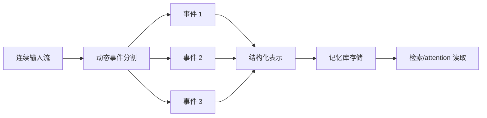

# 方向 D：动态事件分割 + 结构化表示

## 先用人话讲

这个方向研究的是：

**先把长经历切成合理事件，再把每个事件存成好检索、好更新、好推理的结构。**

它其实是在回答两个连续问题：

1. 一段连续经历，边界应该怎么切
2. 切出来以后，应该怎么存

---

## 为什么这个方向很自然

因为现在很多系统只做好了其中一半：

- `EM-LLM` 更擅长切事件
- `GSW` 更擅长把事件表示成结构
- `EpMAN` 更擅长把记忆读进 attention

但它们还没有被真正串成一条完整管线。

所以这个方向的核心思想是：

```text
分割 -> 表示 -> 检索/读取
```

把原本分散在不同论文里的优点接起来。

---

## 一个最简单的类比

你在整理一部长篇电视剧。

第一步你要先分集：
- 哪一段算同一个事件
- 哪一段是新事件开始

第二步你要给每一集写卡片：
- 这一集谁出场
- 发生了什么
- 地点在哪
- 角色关系怎么变了
- 后续埋了什么伏笔

如果不先分集，你的笔记会乱。
如果只分集不写卡片，你以后也不好回忆。

---

## 现有论文分别做了什么

### EM-LLM

解决：
- 连续 token 流中，哪里应该切出事件边界

特点：
- 用 surprise 做动态边界检测
- 不是固定 chunk
- 更接近人类对事件边界的感知

### GSW

解决：
- 每个片段怎么表示成结构化工作空间

特点：
- 存的不是原始文本块
- 而是角色、状态、动作、时空关系

### EpMAN

解决：
- 已经得到 episodic chunks 后，怎么更深地让模型读这些记忆

特点：
- 在 attention / KV cache 层做重加权
- 不只是把检索结果拼进 prompt

---

## 这个方向的标准直觉图



这条管线里每一层都很重要：

- 分割错了，后面全错
- 表示差了，检索就弱
- 读取方式弱，模型又用不好记忆

---

## 这个方向到底值不值得做

值，但它属于一种**组合型创新**。

也就是说，它的亮点不是发明一个完全新概念，
而是把几种本来互补、但没有被系统组合的机制连起来。

这类工作要站得住，关键不在于说：

```text
我把 A + B + C 拼起来了
```

而在于要证明：

```text
这个组合真的比 A、B、C 单独用都更合理、更强
```

---

## 它最适合解决什么问题

### 1. 长叙事理解

例如小说、长文档、长期对话。

### 2. 事件链追踪

例如：
- 某人状态怎么变化
- 某个关系怎么演化
- 某个冲突怎么发展

### 3. 跨事件回忆

例如：
- 当前问题关联哪几个历史事件
- 哪几次事件属于同一主题

### 4. 需要高质量结构化存储的 agent

例如长期用户画像、项目记忆、复杂任务助手。

---

## 一个比较直观的方法设计

### 第一步：用动态边界检测切事件

不要用固定 `256 tokens` 或 `3 句一切`。

而是根据：
- surprise
- 语义转折
- 角色变化
- 时间地点变化

来自适应切事件。

### 第二步：把每个事件变成结构化对象

例如存成：
- actors
- time
- location
- actions
- state changes
- outcomes
- open questions

### 第三步：建立事件之间的关系

关系可以包括：
- 时间顺序
- 同主题
- 同实体
- 因果前后

### 第四步：读取时不要只 top-k 文本拼接

可以：
- 做图检索
- 做 event-level recall
- 或像 EpMAN 那样做 attention 级读取

---

## 它和普通 RAG 的本质区别

普通 RAG 常常像这样：

```text
长文切块 -> embedding -> top-k
```

这个方向更像：

```text
连续经历切事件 -> 事件结构化 -> 关系化存储 -> 面向事件检索
```

所以它更接近"情景记忆系统"，而不是"分块搜索器"。

---

## 这个方向最大的好处

### 好处 1：边界更自然

不会把同一事件拦腰切断，也不容易把多个事件糊在一起。

### 好处 2：存储对象质量更高

不是噪声很大的原始 chunk，而是整理过的事件单元。

### 好处 3：更利于更新

如果同一事件后来有新信息，结构化对象更容易被更新。

### 好处 4：更利于复杂检索

例如：
- 同一角色的多个事件
- 同一地点发生的不同事件
- 某个事件的前因后果

---

## 它最大的难点

### 1. 模块链条长

一个环节做差，就会拖累后面所有环节。

### 2. 结构化表示成本高

特别是如果要靠 LLM 抽结构，成本不低。

### 3. 组合创新容易被质疑

审稿人可能会问：
- 这是不是只是拼装现有模块
- 新东西到底在哪

### 4. 实验设计必须扎实

你必须做足消融：
- 只有动态分割
- 只有结构化表示
- 两者都用
- 再加高级读取

---

## 一个合理的实验表长什么样

你至少要比较：

1. 固定 chunk + 文本检索
2. 动态事件分割 + 文本检索
3. 固定 chunk + 结构化表示
4. 动态事件分割 + 结构化表示
5. 动态事件分割 + 结构化表示 + 高级读取

这样才能看出每一层贡献。

---

## 风险评估

| 维度 | 评价 |
|------|------|
| 创新空间 | 中等偏上 |
| 工程难度 | 中高 |
| 组合价值 | 高 |
| 差异化难度 | 中等 |
| 适合做系统论文吗 | 很适合 |

---

## 最后一句话

这个方向最本质的价值是：

**把长经历从"文本流"变成"事件对象"。**

一旦这步做成，后面的记忆存储、更新、检索、因果追踪都会更顺。

---

## 可继续参考

- EM-LLM: https://arxiv.org/abs/2407.09450
- GSW: https://arxiv.org/abs/2511.07587
- EpMAN: https://aclanthology.org/2025.acl-long.574/

