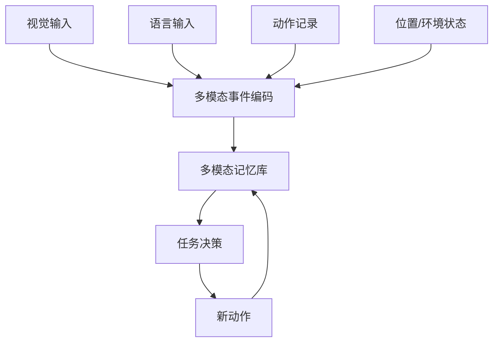

# 方向 E：多模态记忆 / 具身记忆

## 先用人话讲

这个方向研究的是：

**agent 不只记住文字，还要记住看过什么、听过什么、到过哪里、做过什么。**

如果前几个方向主要是在研究"会聊天的记忆系统"，
那这个方向研究的是：

**会行动、会观察、会经历世界的记忆系统。**

---

## 一个最简单的例子

想象一个机器人在房间里找钥匙。

它要记住的东西不只是：
- "钥匙在桌上" 这句话

还包括：
- 它刚刚看见过桌子
- 桌子在客厅左侧
- 自己已经找过沙发下面
- 冰箱旁边曾经出现过类似物体
- 上一次开门后钥匙被移动了

这种记忆已经不是纯文本 memory 了，
而是视觉、空间、动作、时间混合在一起的记忆。

---

## 为什么这个方向难但重要

因为真实世界里的 agent 根本不是只和文本打交道。

它需要处理：
- 图像
- 音频
- 视频
- 位置轨迹
- 动作历史
- 环境状态

如果没有这些记忆，agent 就很难在真实环境中持续行动。

---

## 它和前几个方向的区别

前几个方向更多是在问：

```text
文本信息怎么记住
```

这个方向要问的是：

```text
一个 agent 的经历，怎么作为多模态事件被存下来
```

这会涉及更多类型的记忆：
- 视觉片段
- 语音线索
- 空间地图
- 操作轨迹
- 失败经验

---

## 直观流程图



注意这里的记忆已经不是单个文本 chunk，
而更像：

**"一次完整经历的多模态压缩表示"**

---

## 这个方向最像什么

最像下面这个问题：

**一个 agent 能不能像人一样，记住自己亲身经历过的事情？**

例如：
- 我刚才在哪里看到过这个东西
- 我上一次尝试这个动作失败在哪
- 这条路我走过没有
- 这个房间之前是什么状态

这就是具身记忆。

---

## 为什么它是 frontier

因为它同时碰到三个高难问题：

### 1. 表示难

文本记忆可以直接存句子。
视觉和空间经历不能这么简单处理。

### 2. 对齐难

你要把：
- 看见的
- 说过的
- 做过的
- 环境变化

统一到同一个事件框架里。

### 3. 检索难

问题来了以后，你可能要同时检索：
- 某个视觉目标
- 某个位置
- 某次失败轨迹
- 某段语言说明

---

## 一个非常直观的系统想象

设想一个家务机器人。

当它执行任务时，每次关键经历都可以被记成一个事件包：

```json
{
  "time": "10:31",
  "location": "kitchen",
  "visual_objects": ["mug", "sink", "red towel"],
  "action": "search_for_mug",
  "result": "failed",
  "note": "sink area already checked"
}
```

以后用户说：

```text
杯子可能在哪？
```

它不只是检索语言描述，
还要检索视觉和空间经历。

---

## 这个方向适合结合哪些已有论文思路

### 和事件分割结合

不是每一帧视频都记，而是按"事件"记。

### 和结构化表示结合

把一段具身经历表示成：
- 目标
- 场景
- 动作
- 状态变化
- 成败结果

### 和巩固结合

把很多低层观察整理成高层经验。

例如：

```text
多次失败轨迹 -> 总结成"这个柜门需要先拉再抬"
```

这就是从 episodic memory 变成 procedural memory。

---

## 它最适合解决什么任务

- 机器人导航
- 物体搜索
- 长时序操作任务
- 游戏 agent
- 真实世界 assistant

尤其适合需要：
- 跨时间回忆
- 空间记忆
- 失败经验复用
- 环境变化追踪

---

## 一个新手能理解的实验设计

### 最小版本

1. 让 agent 在环境里执行任务
2. 每隔一段时间记录一条多模态事件
3. 构建记忆库
4. 后续任务中允许 agent 检索历史经历
5. 比较有无记忆时的任务成功率

### 可看的指标

- success rate
- navigation efficiency
- repeated mistake rate
- memory hit rate
- storage cost

---

## 为什么这个方向工程量大

因为它不是只加一个 memory 模块就够了，
而是整个系统都要动：

- 感知模块
- 事件编码模块
- 多模态存储
- 检索器
- 决策器
- benchmark 环境

所以它更像长期系统工程，
不太像最容易起步的首篇选题。

---

## 主要难点

### 1. 基础设施重

要有环境、感知模型、数据流。

### 2. 评测成本高

很多任务要真跑 agent 才知道效果。

### 3. 错误链条更长

视觉错了、定位错了、记忆错了、决策就全错。

### 4. 很难快速迭代

比纯文本 memory 系统慢很多。

---

## 风险评估

| 维度 | 评价 |
|------|------|
| 创新空间 | 很高 |
| 工程难度 | 很高 |
| 适合小步快跑吗 | 不太适合 |
| 适合长期方向吗 | 非常适合 |
| 适合单篇轻量论文吗 | 相对不适合 |

---

## 最后一句话

这个方向最迷人的地方在于，它不再只是让模型"记住文本"，
而是让 agent 真正记住自己经历过的世界。

但也正因为如此，它是五个方向里最重、最慢、最需要基础设施的一个。

---

## 可继续参考

- FindingDory benchmark: https://findingdory-benchmark.github.io/

