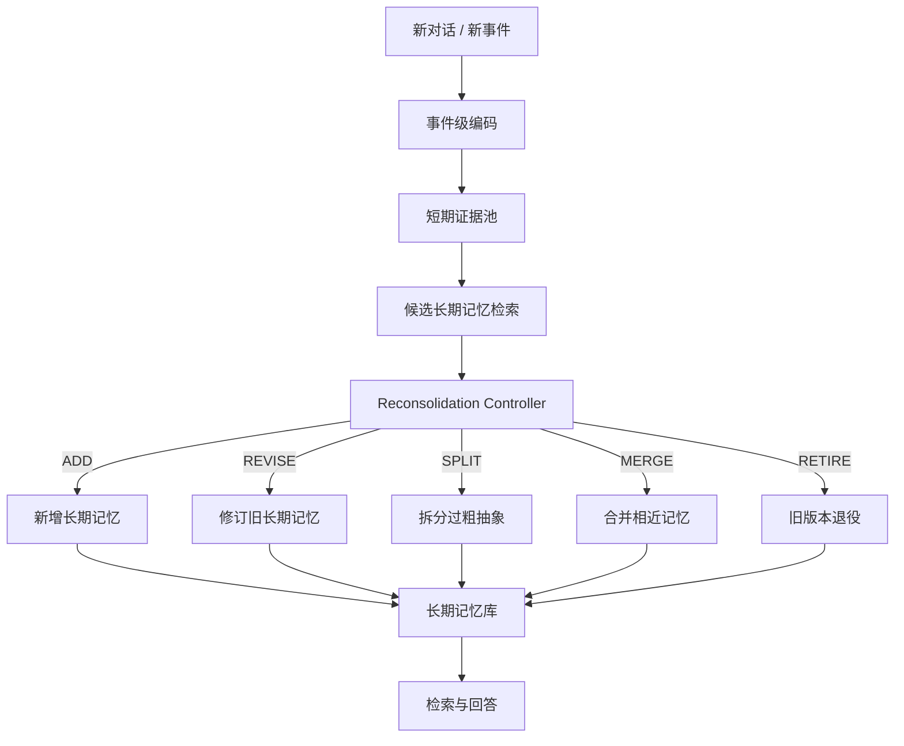
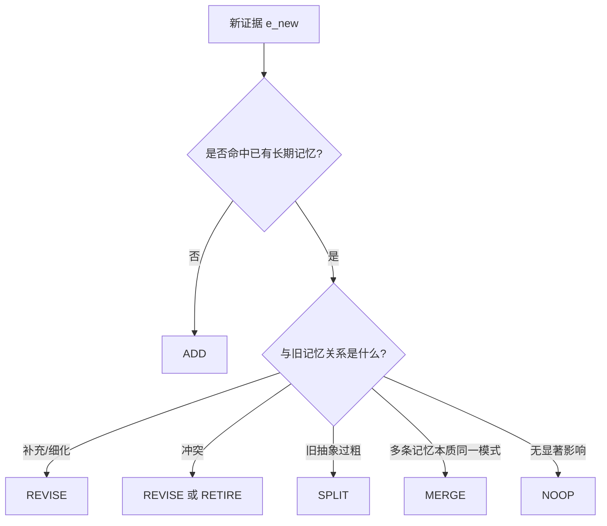

# 记忆巩固方向：Reconsolidation 方法蓝图

## 这份文件的目标

前面的 `PROBLEM_STATEMENT.md` 已经回答了：

- 为什么是 reconsolidation
- 它研究什么
- 它和现有工作差在哪

这份文件要继续回答：

**如果我们真的做一个 reconsolidation 方法，系统应该长什么样？**

---

## 一句话方法概述

我们要做的不是一个“只会存新记忆”的系统，
而是一个：

**能在新证据出现时，重新打开旧长期记忆，判断是否修订、拆分、合并，并保留完整来源链的 memory system。**

---

## 1. 总体框架



这个系统最关键的不是“检索”本身，而是中间这一步：

`Reconsolidation Controller`

它决定：
- 新证据到底只是新建
- 还是应该修改旧记忆
- 还是说明旧抽象太粗，要拆开重来

---

## 2. 系统由哪几个模块组成

建议拆成 6 个模块。

### 模块 1：Episode Builder

职责：
- 把原始对话流整理成 episode-level evidence

输入：
- 最近一轮或几轮交互

输出：

```text
e_i = (content, time, entities, source_session, confidence, raw_span)
```

为什么需要它：
- reconsolidation 不应该直接对 token 或随意 chunk 操作
- 最合理的基本单位还是 episode / evidence

可选上游：
- 固定窗口
- EM-LLM 风格事件分割
- 轻量规则 + LLM 抽取

---

### 模块 2：Long-Term Memory Store

职责：
- 存长期记忆对象及其版本链

普通 memory store 不够，因为这里只存文本不够。

建议对象结构：

```json
{
  "memory_id": "m_1024",
  "memory_text": "用户目前不喜欢蓝色界面，但接受深蓝作为强调色",
  "memory_type": "semantic_preference",
  "status": "active",
  "version": 3,
  "created_at": "2026-04-08",
  "updated_at": "2026-04-20",
  "provenance_set": ["e_14", "e_33", "e_57"],
  "support_set": ["e_33", "e_57"],
  "contradiction_set": ["e_14"],
  "parent_versions": ["m_1024_v1", "m_1024_v2"],
  "confidence": 0.84
}
```

这里最重要的是：
- `status`
- `version`
- `provenance_set`
- `support_set`
- `contradiction_set`

没有这些字段，就很难做真正的 reconsolidation。

---

### 模块 3：Candidate Retriever

职责：
- 根据新证据，找到可能受影响的旧长期记忆

为什么必须有这一层：
- 你不能每来一条新证据就全库重扫
- reconsolidation 需要先缩小可能冲突或相关的候选集合

推荐做法：
- semantic similarity
- lexical overlap
- entity overlap
- time proximity
- memory type filter

输出：

```text
C(e_new) = {l_3, l_19, l_42, ...}
```

这些是“可能需要被修订”的旧长期记忆。

---

### 模块 4：Reconsolidation Controller

职责：
- 决定对每个候选长期记忆执行什么操作

这是方法的核心。

它的输入是：

```text
(e_new, C(e_new), local_context)
```

输出是一个操作决策：

```text
ADD / REVISE / SPLIT / MERGE / RETIRE / NOOP
```

更具体的行为可以写成：



---

### 模块 5：Version Manager

职责：
- 管理旧版本、新版本、退役版本之间的关系

这是 reconsolidation 和普通 update 最大的区别之一。

普通 memory update 往往是：

```text
把旧文本直接改掉
```

这里建议保留版本链：

```text
m_12_v1 -> m_12_v2 -> m_12_v3
```

每次版本变化都要记录：
- 谁触发的
- 为什么改
- 改了哪部分

这会直接带来：
- 可解释性
- 可回滚性
- 可审计性

---

### 模块 6：Retrieval-Time Resolver

职责：
- 在回答问题时，只拿当前有效版本，而不是过时版本

如果没有这层，你即使做了 reconsolidation，回答时仍可能把旧版本拿出来。

因此回答阶段至少要做：
- 过滤 retired memory
- 优先 active latest version
- 如果需要解释，再带 provenance / revision history

---

## 3. 操作定义

这部分最重要，因为这决定你到底是不是在做 reconsolidation。

## 3.1 ADD

条件：
- 新证据与现有长期记忆无足够重合

效果：
- 新建一条长期记忆

典型场景：
- 新兴趣
- 新事实
- 新经历

---

## 3.2 REVISE

条件：
- 新证据与旧长期记忆相关
- 但不是简单重复，而是补充、细化或修正

效果：
- 生成新版本
- 旧版本标记为 `revised`

典型场景：
- 偏好更新
- 事实修正
- 条件补全

例子：

```text
v1: 用户喜欢咖啡
v2: 用户喜欢热咖啡，但不喜欢冰咖啡
```

---

## 3.3 SPLIT

条件：
- 旧长期记忆被发现过于粗糙
- 新证据说明它实际上混了多个模式或多个条件

效果：
- 一条旧记忆拆成多条新记忆
- 旧条目标记为 `retired` 或 `superseded`

典型场景：
- 过度泛化
- 混合偏好
- 多意图被错误并入同一条抽象

例子：

```text
旧: 用户喜欢咖啡
拆分后:
1. 用户喜欢热咖啡
2. 用户不喜欢冰咖啡
```

---

## 3.4 MERGE

条件：
- 多条旧长期记忆实际描述的是同一稳定模式

效果：
- 合并为更紧凑的高层记忆

注意：
- MERGE 不能只是“语义像就合”
- 必须保留 provenance 联合集

---

## 3.5 RETIRE

条件：
- 旧长期记忆已经被新版本彻底取代
- 或已知错误

效果：
- 不再用于默认检索
- 但仍保留版本链和来源

---

## 3.6 NOOP

条件：
- 新证据不够强
- 影响不足
- 暂时不应触发长期修订

作用：
- 防止系统过度敏感、过度重写

---

## 4. 触发机制怎么设计

这是实际系统中最容易做崩的地方。

建议采用“两阶段触发”。

### 阶段 1：粗触发

先快速判断是否可能需要 reconsolidation。

粗触发条件可以包括：
- semantic overlap 高
- entity overlap 高
- 明显否定 / 反转表达
- 出现 preference shift 词
- 出现更细条件限定

### 阶段 2：细决策

对候选记忆做更贵的判断：
- 是补充
- 是冲突
- 是 refinement
- 是 over-generalization evidence

这样能避免每轮都走重推理。

---

## 5. 最小可行版本怎么做

第一版不要追求太重。

建议做一个 rule-based + LLM judge 的混合版本：

### Step 1

把新交互抽成 episode-level evidence

### Step 2

从长期库里召回 top-k 候选旧记忆

### Step 3

让一个判定器输出关系类型：

```text
NEW / SUPPORT / REFINE / CONTRADICT / OVERGENERALIZED / UNRELATED
```

### Step 4

把关系类型映射到操作：

```text
NEW -> ADD
SUPPORT -> update support_set
REFINE -> REVISE
CONTRADICT -> REVISE or RETIRE
OVERGENERALIZED -> SPLIT
UNRELATED -> NOOP
```

### Step 5

把新版本写回长期库，并维护 version chain

这已经足够做第一版实验。

---

## 6. 推荐的数据结构

如果你后面真要写 prototype，建议至少有三张表或三个集合。

### 表 1：Episodes

```text
episode_id
content
time
entities
session_id
raw_span
```

### 表 2：LongMemories

```text
memory_id
version
text
type
status
confidence
created_at
updated_at
```

### 表 3：MemoryEdges

```text
src_id
dst_id
edge_type
```

`edge_type` 可以是：
- supports
- contradicts
- derived_from
- supersedes
- split_from
- merged_from

这样后面无论做检索还是可视化，都会方便很多。

---

## 7. 这个方法的真正创新点应该写在哪

不要把创新点写成：

```text
我们做了 memory store + retriever + updater
```

这太像已有工作。

更好的写法是：

1. 我们把长期记忆建模成**可修订对象**
2. 我们显式建模 `support / contradiction / revision history`
3. 我们提出 `revise / split / retire` 这类结构性操作，而非仅追加更新
4. 我们使抽象记忆保持 `provenance-preserving`

---

## 8. 第一版不要做什么

为了控制风险，第一版建议不要做：

- 复杂 RL controller
- 多模态 memory
- 很重的 graph neural retrieval
- 超复杂 offline scheduler
- 全自动 end-to-end learned reconsolidation policy

第一版只要能证明：

```text
在 delayed contradiction / stale memory / traceability 任务上，
reconsolidation 比单次 consolidation 更好
```

就已经很有价值。

---

## 9. 方法蓝图的最小结论

如果把这份文档压成一句话，那就是：

**Reconsolidation 方法的核心不在“再做一次存储优化”，而在“把长期记忆从静态条目变成可修订、可追溯、可版本化的对象”。**

