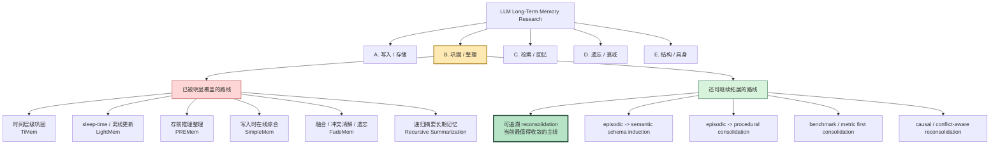
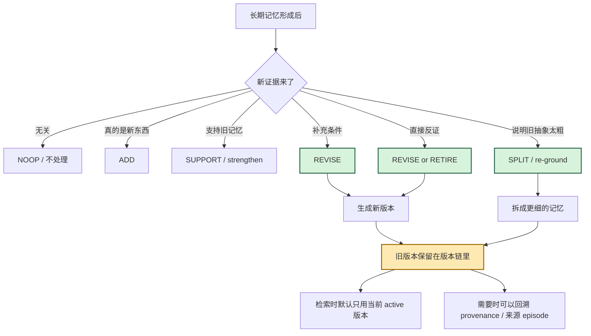
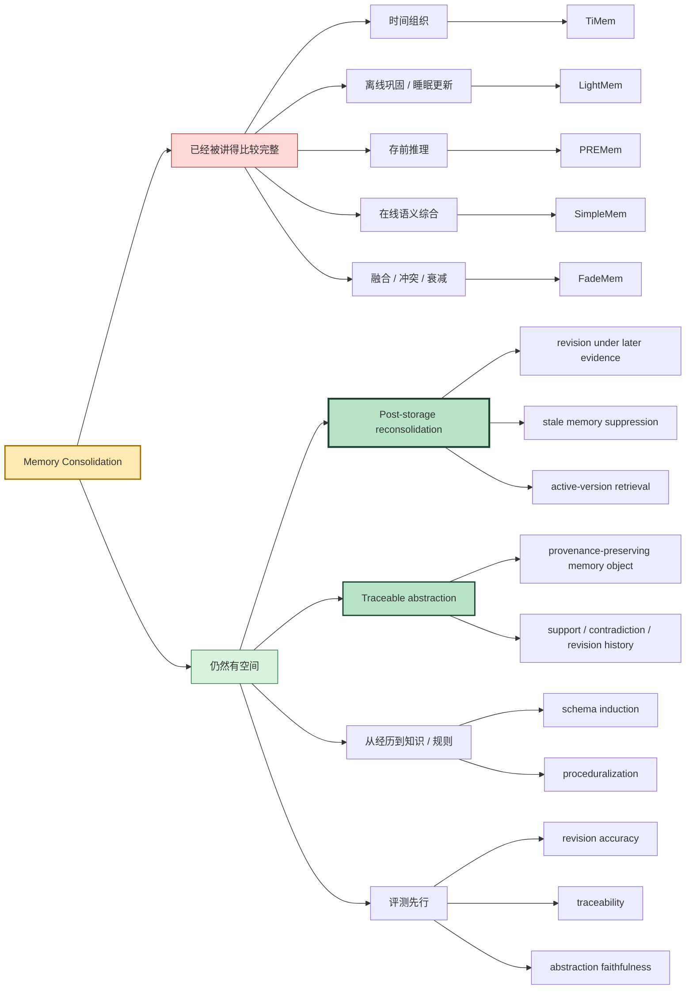
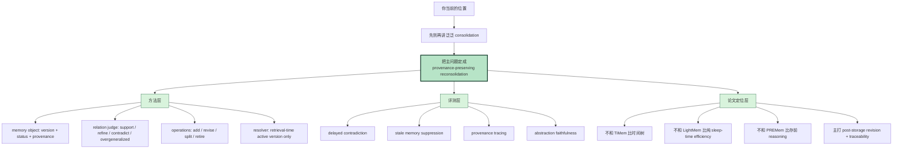

# 记忆巩固方向：可视化研究地图

这份文件不是论文笔记。

它只做一件事：

**把“现有研究已经覆盖到哪”和“你还能往哪做”画成一张更直观的图。**

适合什么时候看：
- 脑子里已经有很多论文名字，但还是容易混
- 想快速判断哪些方向已经拥挤，哪些方向还能切
- 想把自己的研究点放到整张地图里看

---

## 图 1：大地图

这张图要表达的其实很简单：

- “记忆巩固”不是无人区
- 但“可追溯 reconsolidation”还不是一个已经被完全堵死的位置
- 你现在最适合的不是重做一遍 TiMem / LightMem / PREMem
- 而是把问题往后推进一步：**长期记忆形成以后怎么继续演化**

---

## 图 2：把“你现在在做什么”单独拉出来

这张图就是你当前研究问题的人话版：

**不是“怎么再存一条记忆”，而是“旧长期记忆遇到新证据后怎么被修订、拆分、退役，而且修订过程还能追溯”。**

---

## 图 3：现有研究和你的可拓展空间，放在一棵树里看

---

## 图 4：如果你要继续收敛，最推荐怎么走

---

## 一句话读图指南

如果你只记住一句话，就记这个：

**现有论文已经覆盖了“怎么整理一次记忆”，你更值得做的是“整理后的长期记忆如何在后续新证据下继续被可追溯地修订”。**

---

## 你现在最适合继续补强的 4 个点

1. `reconsolidation object` 定义清楚
2. `revision / split / retire` 的触发条件清楚
3. `provenance` 怎么保存与读取清楚
4. 专门评测 `revision` 和 `traceability`，不要只测普通 QA

---

## 对应代表论文

- `TiMem`：时间层级巩固
- `LightMem`：sleep-time / 离线长期更新
- `PREMem`：存前推理整理
- `SimpleMem`：在线语义综合
- `FadeMem`：融合、冲突消解、衰减
- `Recursive Summarization`：递归摘要长期记忆

这些工作更多覆盖的是：
- 怎么整理
- 怎么压缩
- 怎么分层
- 怎么融合

你现在想继续往前推的是：
- 怎么修旧记忆
- 怎么保留版本链
- 怎么保留来源链
- 怎么压住 stale memory
